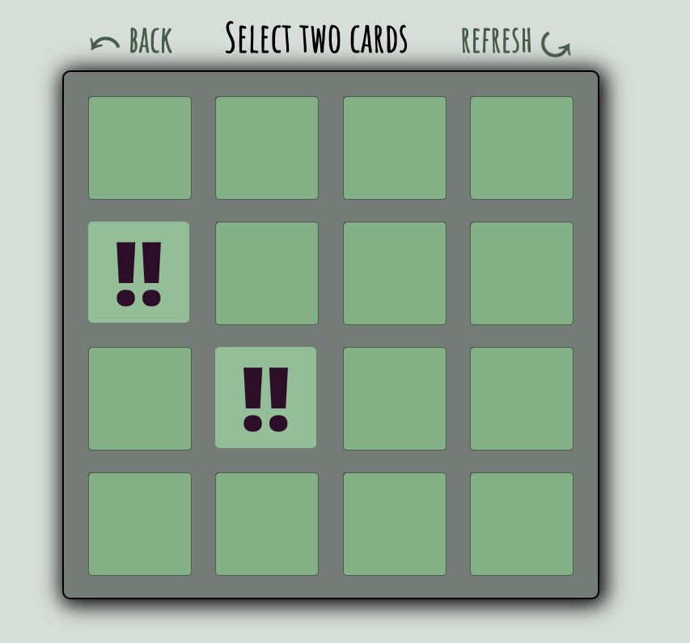

# MVP_DevGroup_Project_1
CF 201 Final Project

### Version Number ()

1. (1.0.0)
    - Wireframe
1. (1.5)
    - placeholders, and general layout of elements
1. (2.0)
    - minimal CSS, improved functionality
1. (2.3)
    - random bug in when cards flipped back over as unmatched
1. (2.7)
    - fixed bugs, cards flip over when they are supposed to
1. (3.0)
    - css color scheme chosen
1. (3.7)
    - css layout and syling complete
1. (4.1.0)
    - added css animations and transitions for buttons

## Team Members 

1. Matt Simms
2. Jacob Holmer
3. Nicki Baldwin
4. Ted Knecht

## General Overview of the Project

The Matching Game 

- The user will be given a webpage that dispays 16 cards facedown that all have an image. When the user clicks two of the cards, they will flip over and display the image. If the images are not a match, they will turn over and the user will have another chance to select two more cards. If the cards are a match,, they will dissapear and the user will continue the game until all the cards are gone. 

## References 

1. Helped with the matching game functionality:

    https://scotch.io/tutorials/how-to-build-a-memory-matching-game-in-javascript

1. Helped with the deck shuffle function :

    https://medium.com/@oldwestaction/randomness-is-hard-e085decbcbb2

1. Helped with cursor:pointer;
    https://www.tutorialrepublic.com/faq/how-to-change-the-cursor-into-a-hand-pointer-on-hover-using-css.php

1. helped with arrow symbols

    https://www.toptal.com/designers/htmlarrows/arrows/

1. helped with css animations

    https://www.w3schools.com/css/css3_animations.asp

## Game Board Example 

## How to play the game

1. The game is a standard matching game consisting of 8 pairs of cards, for a total game board of 16 cards.
1. The user has the opportunity to click on two cards during a round. 
    1. If the cards are a match, they will remain in place and face up.
    1. If the cards are not a match, they will flip back over. 
1. The user has an unlimited number of rounds to find all 8 pairs. 
1. When the user completes the game, a results page is accessible, which displays the users name and number of rounds it took them to complete the game in a congratulatory message. 